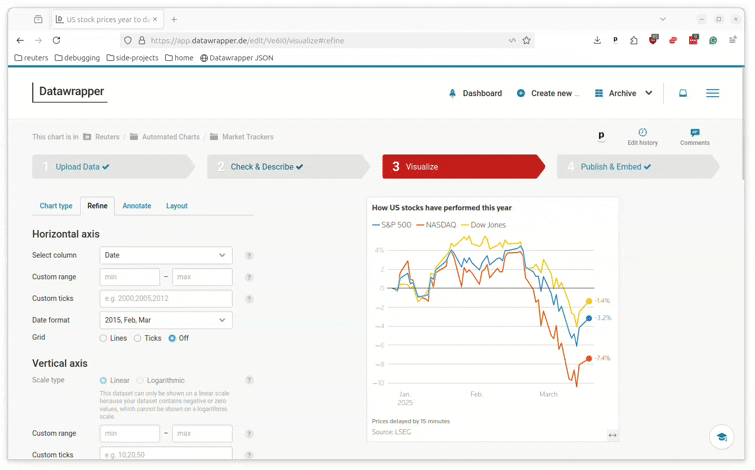
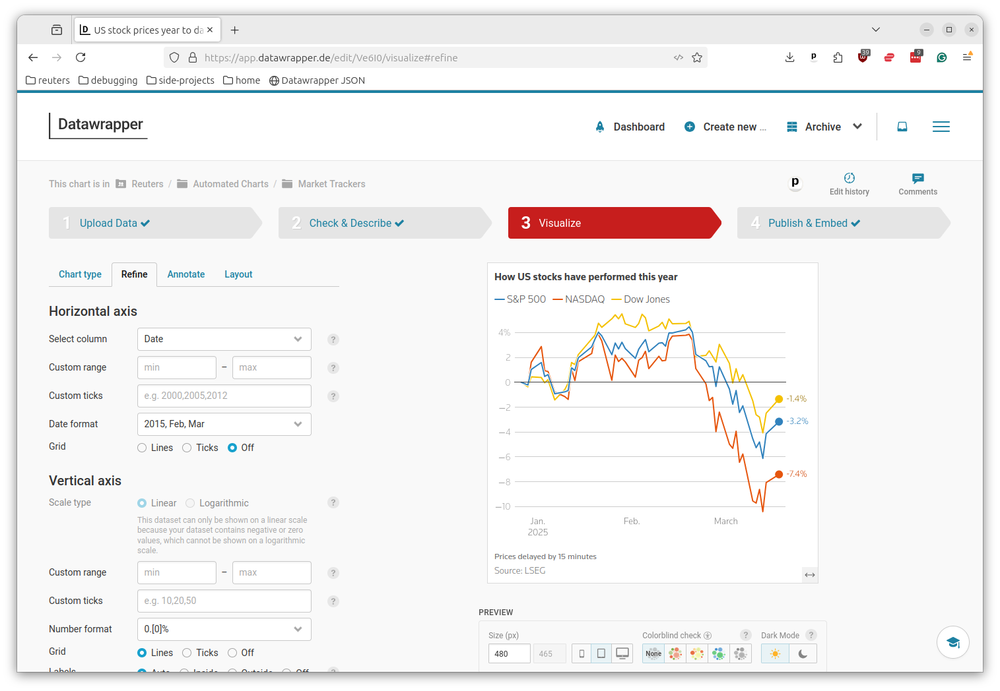
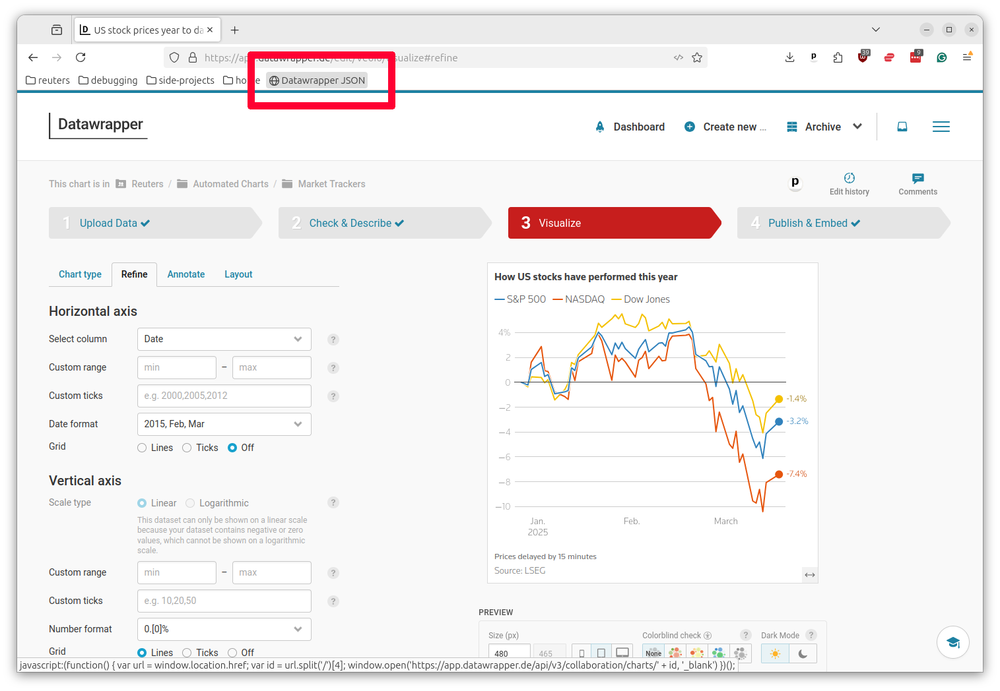
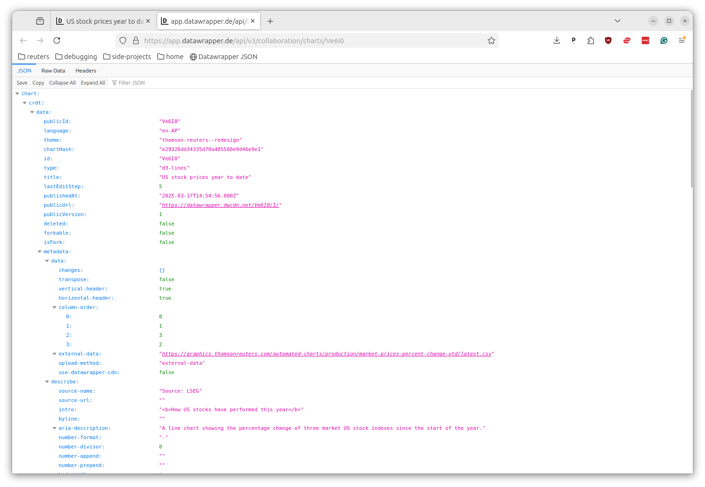

# Datawrapper JSON bookmarklet

Quickly access the JSON configuration of your Datawrapper chart



## Why and what for?

When automating the creation of Datawrapper charts via the service's API, it's not always obvious which backend setting corresponds to which frontend feature.

Reviewing the configuration options generated by the site's point-and-click interface can help you better understand how a chart is assembled.

This bookmarklet will jump you directly from a chart's editing panel to the URL that hosts its configuration in JSON format.

## Getting started

There are two methods for installing the bookmarklet.

### 1. Drag and drop

Drag the link below to your browser's bookmark bar:

<a href="javascript:(function() { var url = window.location.href; var id = url.split('/')[4]; window.open('https://app.datawrapper.de/api/v3/collaboration/charts/' + id, '_blank') })();">Datawrapper JSON</a>

### 2. Paste code

Create a new bookmark in your browser and paste in the following code:

```js
javascript:(function() { var url = window.location.href; var id = url.split('/')[4]; window.open('https://app.datawrapper.de/api/v3/collaboration/charts/' + id, '_blank') })();
```

Add the bookmarklet to your browser's bookmarks bar.

## Usage

Visit the editing panel of a Datawrapper chart inside of your account. It will have a URL like `https://app.datawrapper.de/edit/xyxy12/visualize`



Click the bookmarklet button.



A new tab will open that displays the JSON configuration of your chart.



That's it. That's all we've got for you.